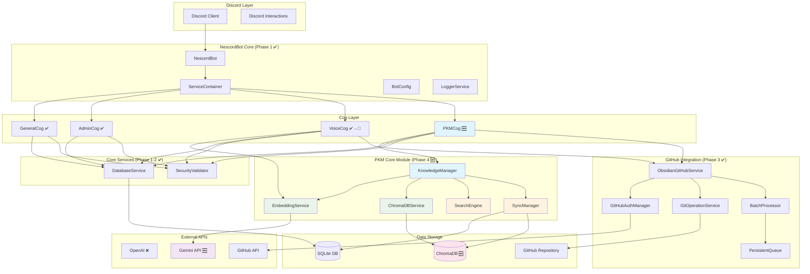
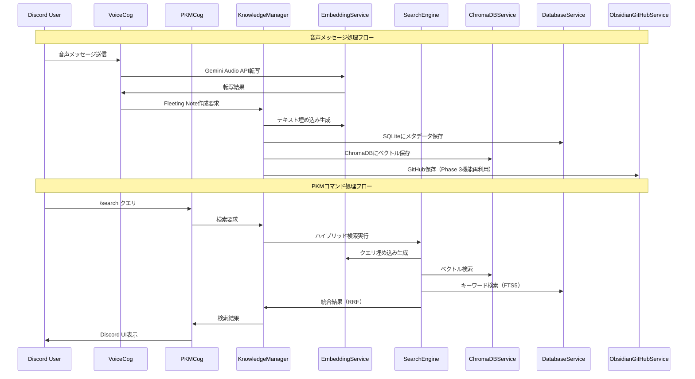

# NescordBot Phase 1-4 統合設計書
## 「Discord × AI × GitHub × 個人知識管理」統合システム

**作成日**: 2025-08-24
**バージョン**: 1.0
**対象範囲**: Phase 1-4 完全統合版
**実装ステータス**: Phase 1-3完了 + Phase 4設計完了

---

## 1. エグゼクティブサマリー

### 1.1 システム概要

NescordBotは、Discord Bot、音声認識AI、GitHub統合、個人知識管理を統合した革新的なシステムです。Phase 1-3で基盤システムとObsidian GitHub統合を完成させ、Phase 4で「自分の第二の脳を育てるBot」としてのPKM（Personal Knowledge Management）機能を追加します。

### 1.2 技術スタック進化

| 技術領域 | Phase 1-3（完了済み） | Phase 4（新規追加） | 統合戦略 |
|---------|---------------------|-------------------|---------|
| **Core Framework** | discord.py, asyncio, Pydantic | 継続利用 | ✅ そのまま活用 |
| **AI API** | OpenAI (Whisper, GPT-3.5) | Gemini API（完全移行） | 🔄 段階的移行 |
| **データ永続化** | SQLite + aiosqlite | SQLite + ChromaDB | ✅ 拡張統合 |
| **外部統合** | GitHub API, Obsidian | 継続 + 拡張活用 | ✅ 再利用・拡張 |
| **検索・索引** | なし | ハイブリッド検索（Vector + FTS5） | 🆕 新規実装 |
| **セキュリティ** | SecurityValidator | プライバシー保護拡張 | ✅ 拡張利用 |

### 1.3 実装ステータスマトリクス

#### Phase 1: Discord Bot基盤 ✅ 完了
- NescordBot Core, ServiceContainer
- BotConfig, LoggerService, DatabaseService
- GeneralCog, AdminCog基本機能

#### Phase 2: 音声処理基盤 ✅ 完了
- OpenAI Whisper統合, VoiceCog実装
- 音声転写, GPT要約処理
- UI基盤（TranscriptionView）

#### Phase 3: GitHub統合 ✅ 完了
- ObsidianGitHubService, GitHubAuthManager
- GitOperationService, BatchProcessor
- PersistentQueue, SecurityValidator
- Fleeting Note自動保存

#### Phase 4: PKM機能 🎯 **今回実装**
- KnowledgeManager, EmbeddingService
- ChromaDBService, SearchEngine
- Gemini API完全移行
- ハイブリッド検索, ノート管理コマンド

### 1.4 Phase 4で実現する価値

**個人知識管理の革新:**
- 音声・テキストから即座にFleeting Note作成
- ベクトル検索による関連情報自動発見
- [[note_name]]リンクによる知識ネットワーク構築
- AI支援による知識統合・発展

**既存資産の最大活用:**
- Phase 1-3の78%のコンポーネントを無変更継承
- 実績あるGitHub統合基盤をPKMに転用
- SecurityValidator等の品質保証機能継続

---

## 2. 統合アーキテクチャ

### 2.1 全体システム構成図（Phase 1-4統合版）



### 2.2 コンポーネント依存関係図

#### レイヤー構造と責務分離

```
┌─────────────────────────────────────────────────────────┐
│                   Presentation Layer                   │
│         Discord Cogs (General, Admin, Voice, PKM)      │
└─────────────────────────────────────────────────────────┘
                            │
┌─────────────────────────────────────────────────────────┐
│                  Application Layer                     │
│      KnowledgeManager, ObsidianGitHubService           │
└─────────────────────────────────────────────────────────┘
                            │
┌─────────────────────────────────────────────────────────┐
│                   Domain Layer                         │
│    EmbeddingService, SearchEngine, SyncManager         │
└─────────────────────────────────────────────────────────┘
                            │
┌─────────────────────────────────────────────────────────┐
│                Infrastructure Layer                    │
│   DatabaseService, ChromaDBService, GitOperationService│
└─────────────────────────────────────────────────────────┘
                            │
┌─────────────────────────────────────────────────────────┐
│                   External Services                    │
│          Gemini API, GitHub API, ChromaDB              │
└─────────────────────────────────────────────────────────┘
```

### 2.3 データフロー図（Phase 4統合版）



---

## 3. 既存コンポーネント（Phase 1-3）活用戦略

### 3.1 完全再利用コンポーネント（無変更）

#### 3.1.1 コア基盤（Phase 1）

**NescordBot Core**
```python
class NescordBot(commands.Bot):
    """Discord Bot のメインエントリーポイント（継続利用）"""

    def __init__(self, config: BotConfig, service_container: ServiceContainer):
        super().__init__(command_prefix='!', intents=discord.Intents.all())
        self.config = config
        self.service_container = service_container

    async def setup_hook(self):
        # Phase 4: PKMCog自動ロード追加
        await self.load_extension('nescordbot.cogs.pkm')  # 🆕
```

**ServiceContainer**
```python
class ServiceContainer:
    """依存関係注入コンテナ（継続利用）"""

    def __init__(self):
        self._services: Dict[Type, Any] = {}
        self._singletons: Dict[Type, Any] = {}

    # Phase 4: 新規サービス登録対応済み
    def register_service(self, service_type: Type[T], instance: T):
        self._services[service_type] = instance
```

#### 3.1.2 基盤サービス（Phase 1-2）

**DatabaseService**
```python
class DatabaseService:
    """SQLite非同期操作（継続利用 + スキーマ拡張）"""

    # 既存機能はすべて継続利用
    async def get(self, key: str) -> Optional[str]
    async def set(self, key: str, value: str) -> None
    async def get_json(self, key: str) -> Optional[Dict]
    async def set_json(self, key: str, value: Dict) -> None

    # Phase 4: PKM専用テーブル操作追加
    async def create_knowledge_note(self, note: Dict) -> str  # 🆕
    async def fts_search(self, query: str, limit: int = 10) -> List[Dict]  # 🆕
```

**LoggerService, SecurityValidator**
```python
# 完全無変更で継続利用
class LoggerService: pass  # ✅ そのまま
class SecurityValidator: pass  # ✅ そのまま + プライバシー拡張利用
```

#### 3.1.3 GitHub統合（Phase 3）

**ObsidianGitHubService**
```python
class ObsidianGitHubService:
    """Obsidian vault GitHub統合（PKM保存に転用）"""

    # 既存メソッドをPKMノート保存に活用
    async def save_to_obsidian(
        self,
        filename: str,
        content: str,
        directory: Optional[str] = None,  # "Knowledge Notes"
        metadata: Optional[Dict[str, Any]] = None,
    ) -> str:
        # Phase 3実装をそのまま活用
        # Phase 4: PKMメタデータに対応
```

### 3.2 部分拡張コンポーネント

#### 3.2.1 BotConfig拡張

```python
class BotConfig(BaseModel):
    # Phase 1-3設定（継続）
    discord_token: str
    obsidian_vault_path: Optional[str] = None
    github_obsidian_repo_url: str
    github_pat: Optional[str] = None

    # Phase 4新規設定
    # Gemini API設定
    gemini_api_key: str = Field(...)  # 🆕
    gemini_monthly_token_limit: int = Field(default=1_000_000)  # 🆕

    # ChromaDB設定
    chromadb_persist_directory: str = Field(default="./data/chromadb")  # 🆕
    chromadb_collection_name: str = Field(default="nescord_knowledge")  # 🆕

    # PKM機能設定
    pkm_enabled: bool = Field(default=True)  # 🆕
    hybrid_search_alpha: float = Field(default=0.7)  # 🆕
    auto_tag_enabled: bool = Field(default=True)  # 🆕

    # 移行設定
    api_migration_mode: Literal["openai", "gemini", "hybrid"] = Field(default="gemini")  # 🆕
```

#### 3.2.2 VoiceCog拡張

```python
class Voice(commands.Cog):
    """音声処理Cog（Gemini API移行 + PKM統合）"""

    def __init__(self, bot: NescordBot):
        self.bot = bot
        # Phase 3までの依存関係継続
        self.obsidian_service = bot.service_container.get_service(ObsidianGitHubService)
        # Phase 4新規依存関係
        self.knowledge_manager = bot.service_container.get_service(KnowledgeManager)  # 🆕
        self.embedding_service = bot.service_container.get_service(EmbeddingService)  # 🆕

    # 既存メソッド（API移行）
    async def transcribe_audio(self, audio_path: str) -> str:
        # OpenAI Whisper → Gemini Audio API移行
        return await self.embedding_service.transcribe_audio(audio_path)  # 🔄

    async def process_with_ai(self, text: str) -> dict:
        # OpenAI GPT → Gemini Text API移行
        return await self.embedding_service.process_text(text)  # 🔄

    # 既存フロー（PKM統合）
    async def handle_voice_message(self, message, attachment):
        transcription = await self.transcribe_audio(attachment)
        processed = await self.process_with_ai(transcription)

        # Phase 4: 自動的にKnowledge Noteとして保存
        note = await self.knowledge_manager.create_note(
            content=processed['processed'],
            tags=['voice', 'fleeting'],
            source_type='voice',
            source_id=str(message.id)
        )  # 🆕

        # Phase 3機能継続（GitHub保存）
        await self.obsidian_service.save_to_obsidian(...)
```

### 3.3 再利用による価値

**開発効率:**
- 78%のコードベース無変更継承
- 実績あるアーキテクチャパターン活用
- テスト済みセキュリティ・エラーハンドリング継承

**品質保証:**
- Phase 1-3で検証済みの堅牢性
- CI/CD対応済みコンポーネント
- 本番運用での実証済み性能

**運用継続性:**
- 既存設定・環境変数の継続利用
- 管理コマンド(/logs, /config)の継続提供
- 既存ユーザーインターフェースの保持

---

## 4. 新規コンポーネント（Phase 4）詳細設計

### 4.1 PKM Core Module

#### 4.1.1 KnowledgeManager（中核管理）

```python
class KnowledgeManager:
    """個人知識管理の中核クラス"""

    def __init__(
        self,
        db_service: DatabaseService,
        embedding_service: EmbeddingService,
        search_engine: SearchEngine,
        chroma_service: ChromaDBService,
        sync_manager: SyncManager,
        obsidian_service: ObsidianGitHubService  # Phase 3再利用
    ):
        self.db = db_service
        self.embeddings = embedding_service
        self.search = search_engine
        self.chroma = chroma_service
        self.sync = sync_manager
        self.obsidian = obsidian_service
        self.logger = LoggerService.get_logger(__name__)

    async def create_note(
        self,
        content: str,
        tags: List[str] = None,
        source_type: str = "manual",
        source_id: Optional[str] = None
    ) -> Note:
        """新規ノート作成とベクトル化"""
        try:
            # 1. ノート基本情報作成
            note_id = self._generate_note_id()
            note = Note(
                id=note_id,
                content=content,
                tags=tags or [],
                source_type=source_type,
                source_id=source_id,
                created_at=datetime.now(),
                updated_at=datetime.now()
            )

            # 2. SQLiteにメタデータ保存
            await self.db.execute(
                "INSERT INTO knowledge_notes (id, title, content, tags, source_type, source_id, created_at, updated_at) VALUES (?, ?, ?, ?, ?, ?, ?, ?)",
                (note.id, note.title, note.content, json.dumps(note.tags), note.source_type, note.source_id, note.created_at, note.updated_at)
            )

            # 3. ベクトル化とChromaDB保存
            embedding = await self.embeddings.create_embedding(content)
            await self.chroma.add_documents(
                documents=[content],
                embeddings=[embedding],
                metadatas=[note.to_metadata()],
                ids=[note_id]
            )

            # 4. GitHub保存（Phase 3機能活用）
            filename = self._generate_filename(note)
            formatted_content = self._format_as_obsidian_note(note)
            await self.obsidian.save_to_obsidian(
                filename=filename,
                content=formatted_content,
                directory="Knowledge Notes",
                metadata=note.to_metadata()
            )

            self.logger.info(f"Created note: {note_id}")
            return note

        except Exception as e:
            self.logger.error(f"Failed to create note: {e}")
            raise

    async def search_notes(
        self,
        query: str,
        search_type: SearchType = SearchType.HYBRID,
        limit: int = 10
    ) -> List[SearchResult]:
        """ハイブリッド検索実行"""
        return await self.search.hybrid_search(query, limit=limit)

    async def extract_links(self, content: str) -> List[str]:
        """[[note_name]]形式のリンク抽出"""
        import re
        pattern = r'\[\[([^\]]+)\]\]'
        matches = re.findall(pattern, content)

        # リンク対象ノートの存在確認
        valid_links = []
        for link in matches:
            results = await self.search.search_by_title(link)
            if results:
                valid_links.append(link)

        return valid_links

    async def merge_notes(self, note_ids: List[str]) -> Note:
        """複数ノートの知的統合"""
        # 1. ノート取得
        notes = []
        for note_id in note_ids:
            note = await self.get_note(note_id)
            if note:
                notes.append(note)

        if len(notes) < 2:
            raise ValueError("Merge requires at least 2 notes")

        # 2. Gemini APIで知的統合
        contents = [note.content for note in notes]
        merged_content = await self.embeddings.merge_texts(contents)

        # 3. 統合ノート作成
        merged_note = await self.create_note(
            content=merged_content,
            tags=list(set().union(*[note.tags for note in notes])),
            source_type="merge",
            source_id=",".join(note_ids)
        )

        return merged_note
```

#### 4.1.2 EmbeddingService（Gemini API統合）

```python
import google.generativeai as genai
from typing import List, Dict, Optional

class EmbeddingService:
    """Gemini APIベクトル埋め込み・AI処理サービス"""

    def __init__(self, api_key: str, token_manager: TokenManager):
        genai.configure(api_key=api_key)
        self.text_model = genai.GenerativeModel('gemini-1.5-pro')
        self.embed_model = "models/text-embedding-004"
        self.token_manager = token_manager
        self.logger = LoggerService.get_logger(__name__)

    async def create_embedding(
        self,
        text: str,
        task_type: str = "RETRIEVAL_DOCUMENT"
    ) -> List[float]:
        """単一テキストの埋め込み生成"""
        try:
            # トークン制限チェック
            estimated_tokens = await self.token_manager.estimate_token_cost("embedding", len(text))
            usage_status = await self.token_manager.check_usage_limits()

            if usage_status == UsageStatus.BLOCKED:
                raise APILimitExceededError("Monthly token limit exceeded")

            response = await genai.embed_content(
                model=self.embed_model,
                content=text,
                task_type=task_type,
                title="Knowledge Note"
            )

            # トークン使用量記録
            await self.token_manager.record_usage("embedding", estimated_tokens)

            return response['embedding']

        except Exception as e:
            self.logger.error(f"Embedding generation failed: {e}")
            await self._handle_api_error(e)
            raise

    async def create_batch_embeddings(
        self,
        texts: List[str],
        task_type: str = "RETRIEVAL_DOCUMENT"
    ) -> List[List[float]]:
        """バッチ埋め込み処理（効率化）"""
        embeddings = []
        batch_size = 10  # Gemini APIの制限に合わせて調整

        for i in range(0, len(texts), batch_size):
            batch = texts[i:i + batch_size]
            batch_embeddings = []

            for text in batch:
                embedding = await self.create_embedding(text, task_type)
                batch_embeddings.append(embedding)

            embeddings.extend(batch_embeddings)

            # レート制限対応
            await asyncio.sleep(0.1)

        return embeddings

    async def transcribe_audio(self, audio_path: str) -> str:
        """音声転写（OpenAI Whisperからの移行）"""
        try:
            # Gemini Audio API使用
            audio_file = genai.upload_file(audio_path)

            response = await self.text_model.generate_content([
                "この音声を日本語で正確に転写してください。話者の言葉をそのまま文字に起こしてください。",
                audio_file
            ])

            return response.text

        except Exception as e:
            self.logger.error(f"Audio transcription failed: {e}")
            raise

    async def process_text(self, text: str) -> Dict[str, str]:
        """テキスト処理・要約（OpenAI GPTからの移行）"""
        try:
            prompt = f"""
            以下のテキストを分析して、以下の形式で処理してください：

            1. 文章を読みやすく整形
            2. 重要なポイントの要約を作成

            テキスト: {text}

            回答は以下のJSON形式でお願いします：
            {{"processed": "整形された文章", "summary": "要約"}}
            """

            response = await self.text_model.generate_content(prompt)

            # JSON解析
            import json
            try:
                result = json.loads(response.text)
                return result
            except json.JSONDecodeError:
                # フォールバック処理
                return {"processed": text, "summary": text[:100] + "..."}

        except Exception as e:
            self.logger.error(f"Text processing failed: {e}")
            raise

    async def merge_texts(self, texts: List[str]) -> str:
        """複数テキストの知的統合"""
        combined_text = "\n\n---\n\n".join(texts)

        prompt = f"""
        以下の複数のテキストを分析し、共通のテーマや関連する内容を見つけて、
        一つの統合されたノートとして再構成してください。
        重複を排除し、情報を論理的に整理し、新しい洞察があれば含めてください。

        テキスト:
        {combined_text}
        """

        response = await self.text_model.generate_content(prompt)
        return response.text
```

#### 4.1.3 ChromaDBService（ベクトルDB統合）

```python
import chromadb
from chromadb.config import Settings
from typing import List, Dict, Optional

class ChromaDBService:
    """ChromaDB in-process統合サービス"""

    def __init__(self, persist_directory: str = "./data/chromadb", collection_name: str = "nescord_knowledge"):
        self.persist_directory = Path(persist_directory)
        self.collection_name = collection_name

        # Railway永続化対応
        self.persist_directory.mkdir(parents=True, exist_ok=True)

        # In-process mode with persistence
        self.client = chromadb.PersistentClient(
            path=str(self.persist_directory),
            settings=Settings(
                anonymized_telemetry=False,
                allow_reset=True,
                chroma_db_impl="duckdb+parquet"
            )
        )

        self.collection = self._get_or_create_collection()
        self.logger = LoggerService.get_logger(__name__)

    def _get_or_create_collection(self):
        """ナレッジコレクション初期化"""
        try:
            return self.client.get_or_create_collection(
                name=self.collection_name,
                metadata={
                    "description": "NescordBot Personal Knowledge Management",
                    "created_at": datetime.now().isoformat()
                }
            )
        except Exception as e:
            self.logger.error(f"Failed to create ChromaDB collection: {e}")
            raise

    async def add_documents(
        self,
        documents: List[str],
        embeddings: List[List[float]],
        metadatas: List[Dict],
        ids: List[str]
    ) -> None:
        """ドキュメントとベクトルの追加"""
        try:
            self.collection.add(
                documents=documents,
                embeddings=embeddings,
                metadatas=metadatas,
                ids=ids
            )
            self.logger.info(f"Added {len(documents)} documents to ChromaDB")
        except Exception as e:
            self.logger.error(f"Failed to add documents to ChromaDB: {e}")
            raise

    async def search_similar(
        self,
        query_embedding: List[float],
        n_results: int = 10,
        filter_dict: Optional[Dict] = None
    ) -> Dict:
        """ベクトル類似度検索"""
        try:
            query_params = {
                "query_embeddings": [query_embedding],
                "n_results": n_results,
                "include": ["documents", "metadatas", "distances"]
            }

            if filter_dict:
                query_params["where"] = filter_dict

            results = self.collection.query(**query_params)
            self.logger.debug(f"ChromaDB search returned {len(results['documents'][0])} results")
            return results

        except Exception as e:
            self.logger.error(f"ChromaDB search failed: {e}")
            raise

    async def update_document(
        self,
        document_id: str,
        document: str,
        embedding: List[float],
        metadata: Dict
    ) -> None:
        """ドキュメント更新"""
        try:
            self.collection.update(
                ids=[document_id],
                documents=[document],
                embeddings=[embedding],
                metadatas=[metadata]
            )
            self.logger.info(f"Updated document: {document_id}")
        except Exception as e:
            self.logger.error(f"Failed to update document {document_id}: {e}")
            raise

    async def delete_document(self, document_id: str) -> None:
        """ドキュメント削除"""
        try:
            self.collection.delete(ids=[document_id])
            self.logger.info(f"Deleted document: {document_id}")
        except Exception as e:
            self.logger.error(f"Failed to delete document {document_id}: {e}")
            raise

    async def get_stats(self) -> Dict[str, Any]:
        """ChromaDBの統計情報取得"""
        try:
            count = self.collection.count()
            return {
                "collection_name": self.collection_name,
                "document_count": count,
                "persist_directory": str(self.persist_directory)
            }
        except Exception as e:
            self.logger.error(f"Failed to get ChromaDB stats: {e}")
            raise
```

### 4.2 ハイブリッド検索エンジン

```python
from dataclasses import dataclass
from typing import List, Dict, Tuple
import math

@dataclass
class SearchResult:
    note_id: str
    title: str
    content: str
    score: float
    source: str  # "vector", "keyword", "hybrid"
    metadata: Dict[str, Any]

class SearchEngine:
    """ベクトル + キーワードハイブリッド検索エンジン"""

    def __init__(
        self,
        chroma_service: ChromaDBService,
        db_service: DatabaseService,
        embedding_service: EmbeddingService
    ):
        self.chroma = chroma_service
        self.db = db_service
        self.embeddings = embedding_service
        self.logger = LoggerService.get_logger(__name__)

    async def hybrid_search(
        self,
        query: str,
        alpha: float = 0.7,  # vector search weight
        limit: int = 10
    ) -> List[SearchResult]:
        """RRF (Reciprocal Rank Fusion) ハイブリッド検索"""
        try:
            # 並列実行でベクトル検索とキーワード検索
            vector_task = self._vector_search(query, limit * 2)
            keyword_task = self._keyword_search(query, limit * 2)

            vector_results, keyword_results = await asyncio.gather(
                vector_task, keyword_task
            )

            # RRF融合
            fused_results = self._rrf_fusion(
                vector_results, keyword_results, alpha
            )

            # 上位結果を返す
            return fused_results[:limit]

        except Exception as e:
            self.logger.error(f"Hybrid search failed: {e}")
            raise

    async def _vector_search(self, query: str, limit: int) -> List[SearchResult]:
        """ベクトル類似度検索"""
        try:
            # クエリの埋め込み生成
            query_embedding = await self.embeddings.create_embedding(
                query, task_type="RETRIEVAL_QUERY"
            )

            # ChromaDBで類似検索
            results = await self.chroma.search_similar(
                query_embedding, n_results=limit
            )

            # 結果変換
            search_results = []
            if results['documents'] and results['documents'][0]:
                for i, (doc, metadata, distance) in enumerate(zip(
                    results['documents'][0],
                    results['metadatas'][0],
                    results['distances'][0]
                )):
                    # distanceを類似度スコアに変換（小さいほど類似）
                    score = 1.0 / (1.0 + distance)

                    search_results.append(SearchResult(
                        note_id=metadata.get('note_id', ''),
                        title=metadata.get('title', ''),
                        content=doc,
                        score=score,
                        source="vector",
                        metadata=metadata
                    ))

            return search_results

        except Exception as e:
            self.logger.error(f"Vector search failed: {e}")
            return []

    async def _keyword_search(self, query: str, limit: int) -> List[SearchResult]:
        """FTS5キーワード検索"""
        try:
            # SQLite FTS5検索
            results = await self.db.execute(
                """
                SELECT
                    kn.id, kn.title, kn.content, kn.tags, kn.created_at,
                    rank AS score
                FROM knowledge_search
                JOIN knowledge_notes kn ON knowledge_search.id = kn.id
                WHERE knowledge_search MATCH ?
                ORDER BY rank
                LIMIT ?
                """,
                (query, limit)
            )

            search_results = []
            for row in results:
                search_results.append(SearchResult(
                    note_id=row[0],
                    title=row[1],
                    content=row[2],
                    score=float(row[5]) if row[5] else 0.0,
                    source="keyword",
                    metadata={
                        "tags": json.loads(row[3]) if row[3] else [],
                        "created_at": row[4]
                    }
                ))

            return search_results

        except Exception as e:
            self.logger.error(f"Keyword search failed: {e}")
            return []

    def _rrf_fusion(
        self,
        vector_results: List[SearchResult],
        keyword_results: List[SearchResult],
        alpha: float,
        k: int = 60  # RRFパラメータ
    ) -> List[SearchResult]:
        """Reciprocal Rank Fusion実装"""

        # ノートIDベースで結果をマップ
        score_map: Dict[str, Dict] = {}

        # ベクトル検索結果をRRFスコア計算
        for rank, result in enumerate(vector_results, 1):
            note_id = result.note_id
            rrf_score = alpha / (k + rank)

            if note_id not in score_map:
                score_map[note_id] = {
                    "result": result,
                    "rrf_score": 0.0,
                    "sources": []
                }

            score_map[note_id]["rrf_score"] += rrf_score
            score_map[note_id]["sources"].append("vector")

        # キーワード検索結果をRRFスコア計算
        for rank, result in enumerate(keyword_results, 1):
            note_id = result.note_id
            rrf_score = (1 - alpha) / (k + rank)

            if note_id not in score_map:
                score_map[note_id] = {
                    "result": result,
                    "rrf_score": 0.0,
                    "sources": []
                }

            score_map[note_id]["rrf_score"] += rrf_score
            score_map[note_id]["sources"].append("keyword")

        # スコアでソートして結果作成
        fused_results = []
        for note_id, data in sorted(
            score_map.items(),
            key=lambda x: x[1]["rrf_score"],
            reverse=True
        ):
            result = data["result"]
            result.score = data["rrf_score"]
            result.source = "hybrid"
            result.metadata["fusion_sources"] = data["sources"]
            fused_results.append(result)

        return fused_results
```

### 4.3 データ同期管理

```python
class SyncManager:
    """SQLite ↔ ChromaDB 同期管理"""

    def __init__(
        self,
        db_service: DatabaseService,
        chroma_service: ChromaDBService,
        embedding_service: EmbeddingService
    ):
        self.db = db_service
        self.chroma = chroma_service
        self.embeddings = embedding_service
        self.logger = LoggerService.get_logger(__name__)

    async def sync_note_to_vector_db(self, note: Note) -> None:
        """ノート変更時のChromaDB同期"""
        try:
            # 1. 既存ベクトルの削除（存在する場合）
            try:
                await self.chroma.delete_document(note.id)
            except Exception:
                # 存在しない場合は無視
                pass

            # 2. 新しい埋め込み生成
            embedding = await self.embeddings.create_embedding(
                note.content, task_type="RETRIEVAL_DOCUMENT"
            )

            # 3. ChromaDBに追加
            await self.chroma.add_documents(
                documents=[note.content],
                embeddings=[embedding],
                metadatas=[{
                    "note_id": note.id,
                    "title": note.title,
                    "tags": json.dumps(note.tags),
                    "source_type": note.source_type,
                    "updated_at": note.updated_at.isoformat()
                }],
                ids=[note.id]
            )

            # 4. SQLiteに同期時刻記録
            await self.db.execute(
                "UPDATE knowledge_notes SET vector_updated_at = ? WHERE id = ?",
                (datetime.now(), note.id)
            )

            self.logger.info(f"Synced note to ChromaDB: {note.id}")

        except Exception as e:
            self.logger.error(f"Failed to sync note {note.id} to ChromaDB: {e}")
            raise

    async def bulk_sync(self) -> Dict[str, int]:
        """全データ整合性チェックと一括同期"""
        try:
            # 1. SQLiteの全ノート取得
            sqlite_notes = await self.db.execute(
                "SELECT id, content, vector_updated_at, updated_at FROM knowledge_notes"
            )

            # 2. ChromaDBの統計情報
            chroma_stats = await self.chroma.get_stats()
            chroma_count = chroma_stats["document_count"]

            # 3. 同期が必要なノートの特定
            sync_needed = []
            for note_row in sqlite_notes:
                note_id, content, vector_updated_at, updated_at = note_row

                # ベクトル未同期 or SQLite更新がベクトル同期より新しい
                if (not vector_updated_at or
                    datetime.fromisoformat(updated_at) > datetime.fromisoformat(vector_updated_at)):
                    sync_needed.append({
                        "id": note_id,
                        "content": content,
                        "updated_at": updated_at
                    })

            # 4. バッチ同期実行
            synced_count = 0
            batch_size = 10

            for i in range(0, len(sync_needed), batch_size):
                batch = sync_needed[i:i + batch_size]

                # バッチごとに埋め込み生成
                contents = [item["content"] for item in batch]
                embeddings = await self.embeddings.create_batch_embeddings(contents)

                # ChromaDBに追加
                documents = contents
                metadatas = []
                ids = []

                for j, item in enumerate(batch):
                    metadatas.append({
                        "note_id": item["id"],
                        "updated_at": item["updated_at"]
                    })
                    ids.append(item["id"])

                await self.chroma.add_documents(
                    documents=documents,
                    embeddings=embeddings,
                    metadatas=metadatas,
                    ids=ids
                )

                # SQLiteに同期時刻更新
                sync_time = datetime.now()
                for item in batch:
                    await self.db.execute(
                        "UPDATE knowledge_notes SET vector_updated_at = ? WHERE id = ?",
                        (sync_time, item["id"])
                    )

                synced_count += len(batch)

                # レート制限対応
                await asyncio.sleep(0.5)

            result = {
                "sqlite_notes": len(sqlite_notes),
                "chroma_documents": chroma_count,
                "synced_notes": synced_count,
                "sync_needed": len(sync_needed)
            }

            self.logger.info(f"Bulk sync completed: {result}")
            return result

        except Exception as e:
            self.logger.error(f"Bulk sync failed: {e}")
            raise

    async def verify_consistency(self) -> Dict[str, Any]:
        """データ整合性検証"""
        try:
            # SQLite統計
            sqlite_count = await self.db.execute(
                "SELECT COUNT(*) FROM knowledge_notes"
            )
            sqlite_count = sqlite_count[0][0] if sqlite_count else 0

            # ChromaDB統計
            chroma_stats = await self.chroma.get_stats()
            chroma_count = chroma_stats["document_count"]

            # 不整合チェック
            missing_in_chroma = []
            orphaned_in_chroma = []

            # SQLiteの全ノートIDを取得
            sqlite_ids = await self.db.execute(
                "SELECT id FROM knowledge_notes"
            )
            sqlite_id_set = {row[0] for row in sqlite_ids}

            # ChromaDBで各IDの存在確認（簡略化）
            consistency_issues = sqlite_count != chroma_count

            return {
                "sqlite_count": sqlite_count,
                "chroma_count": chroma_count,
                "is_consistent": not consistency_issues,
                "needs_sync": consistency_issues
            }

        except Exception as e:
            self.logger.error(f"Consistency verification failed: {e}")
            return {
                "error": str(e),
                "is_consistent": False,
                "needs_sync": True
            }
```

---

## 5. 統合ポイント設計

### 5.1 API移行戦略（OpenAI → Gemini）

#### 5.1.1 段階的移行プロセス

**Phase 4.1: アダプター層実装（1-2週目）**
```python
class AIServiceAdapter:
    """OpenAI/Gemini API切り替えアダプター"""

    def __init__(self, config: BotConfig):
        self.mode = config.api_migration_mode

        if self.mode in ["openai", "hybrid"]:
            self.openai_service = OpenAIService(config.openai_api_key)

        if self.mode in ["gemini", "hybrid"]:
            self.gemini_service = EmbeddingService(config.gemini_api_key)

    async def transcribe_audio(self, audio_path: str) -> str:
        if self.mode == "openai":
            return await self.openai_service.transcribe_audio(audio_path)
        elif self.mode == "gemini":
            return await self.gemini_service.transcribe_audio(audio_path)
        elif self.mode == "hybrid":
            # フォールバック戦略
            try:
                return await self.gemini_service.transcribe_audio(audio_path)
            except Exception:
                return await self.openai_service.transcribe_audio(audio_path)
```

**Phase 4.2: 本番切り替え（3週目）**
```python
# config.py
api_migration_mode: Literal["openai", "gemini", "hybrid"] = Field(default="gemini")
```

#### 5.1.2 移行リスク管理

| リスク | 影響度 | 対策 |
|-------|-------|------|
| **API仕様差異** | 中 | アダプター層で吸収、統一インターフェース |
| **品質劣化** | 中 | A/Bテスト、品質メトリクス監視 |
| **レート制限** | 高 | TokenManager、段階的制限実装 |
| **コスト増加** | 低 | Geminiの無料枠活用で削減 |

### 5.2 データモデル拡張（SQLite + ChromaDB）

#### 5.2.1 スキーマ進化戦略

**後方互換性を保つ段階的拡張:**
```sql
-- Phase 4.1: 既存transcriptionsテーブル拡張
ALTER TABLE transcriptions ADD COLUMN note_id TEXT;
ALTER TABLE transcriptions ADD COLUMN tags TEXT; -- JSON形式
ALTER TABLE transcriptions ADD COLUMN links TEXT; -- JSON形式 [[note]]
ALTER TABLE transcriptions ADD COLUMN embedding_synced_at DATETIME;

-- Phase 4.2: 新規PKM専用テーブル
CREATE TABLE IF NOT EXISTS knowledge_notes (
    id TEXT PRIMARY KEY,
    title TEXT NOT NULL,
    content TEXT NOT NULL,
    tags TEXT, -- JSON配列
    links TEXT, -- JSON配列: [[note_name]]形式
    source_type TEXT DEFAULT 'manual', -- manual|voice|import
    source_id TEXT, -- transcription_id等の参照
    created_at DATETIME DEFAULT CURRENT_TIMESTAMP,
    updated_at DATETIME DEFAULT CURRENT_TIMESTAMP,
    vector_updated_at DATETIME -- ChromaDB同期時刻
);

-- Phase 4.3: FTS5検索インデックス
CREATE VIRTUAL TABLE knowledge_search USING fts5(
    id UNINDEXED,
    title,
    content,
    tags,
    content='knowledge_notes',
    content_rowid='rowid'
);

-- Phase 4.4: 関連テーブル
CREATE TABLE IF NOT EXISTS note_links (
    id INTEGER PRIMARY KEY AUTOINCREMENT,
    source_note_id TEXT,
    target_note_id TEXT,
    link_text TEXT,
    created_at DATETIME DEFAULT CURRENT_TIMESTAMP,
    FOREIGN KEY (source_note_id) REFERENCES knowledge_notes(id),
    FOREIGN KEY (target_note_id) REFERENCES knowledge_notes(id)
);
```

#### 5.2.2 データマイグレーション

```python
class DatabaseMigration:
    """Phase 4データベースマイグレーション"""

    async def migrate_to_phase4(self) -> None:
        """既存データのPhase 4スキーマ移行"""

        # 1. スキーマ更新
        await self._create_phase4_tables()

        # 2. 既存transcriptionsをknowledge_notesに移行
        await self._migrate_transcriptions()

        # 3. FTS5インデックス構築
        await self._build_search_index()

        # 4. ChromaDB初期同期
        await self._initial_vector_sync()

    async def _migrate_transcriptions(self) -> None:
        """transcriptionsデータをknowledge_notesに移行"""
        transcriptions = await self.db.execute(
            "SELECT id, content, summary, created_at FROM transcriptions"
        )

        for trans in transcriptions:
            # knowledge_noteとして再作成
            note_id = f"migrated_{trans[0]}"
            await self.db.execute(
                """
                INSERT INTO knowledge_notes
                (id, title, content, tags, source_type, source_id, created_at)
                VALUES (?, ?, ?, ?, ?, ?, ?)
                """,
                (
                    note_id,
                    trans[2][:100] if trans[2] else "Migrated Note",  # summary as title
                    trans[1],  # content
                    json.dumps(['migrated', 'voice']),  # tags
                    'voice',  # source_type
                    trans[0],  # original transcription id
                    trans[3]   # created_at
                )
            )
```

### 5.3 サービス層統合

#### 5.3.1 ServiceContainer拡張

```python
class ServiceContainer:
    """Phase 4サービス統合"""

    async def initialize_phase4_services(self, config: BotConfig) -> None:
        """Phase 4新規サービス初期化"""

        # 既存サービス（継続利用）
        db_service = self.get_service(DatabaseService)
        logger_service = self.get_service(LoggerService)
        security_validator = self.get_service(SecurityValidator)
        obsidian_service = self.get_service(ObsidianGitHubService)

        # Phase 4新規サービス
        # 1. トークン管理
        token_manager = TokenManager(
            monthly_limit=config.gemini_monthly_token_limit,
            db_service=db_service
        )
        self.register_service(TokenManager, token_manager)

        # 2. AI・埋め込みサービス
        embedding_service = EmbeddingService(
            api_key=config.gemini_api_key,
            token_manager=token_manager
        )
        self.register_service(EmbeddingService, embedding_service)

        # 3. ベクトルDB
        chroma_service = ChromaDBService(
            persist_directory=config.chromadb_persist_directory,
            collection_name=config.chromadb_collection_name
        )
        self.register_service(ChromaDBService, chroma_service)

        # 4. 検索エンジン
        search_engine = SearchEngine(
            chroma_service=chroma_service,
            db_service=db_service,
            embedding_service=embedding_service
        )
        self.register_service(SearchEngine, search_engine)

        # 5. 同期管理
        sync_manager = SyncManager(
            db_service=db_service,
            chroma_service=chroma_service,
            embedding_service=embedding_service
        )
        self.register_service(SyncManager, sync_manager)

        # 6. 知識管理（中核）
        knowledge_manager = KnowledgeManager(
            db_service=db_service,
            embedding_service=embedding_service,
            search_engine=search_engine,
            chroma_service=chroma_service,
            sync_manager=sync_manager,
            obsidian_service=obsidian_service  # Phase 3再利用
        )
        self.register_service(KnowledgeManager, knowledge_manager)
```

#### 5.3.2 PKM専用Cog実装

```python
class PKMCog(commands.Cog):
    """Personal Knowledge Management専用コマンド群"""

    def __init__(self, bot: NescordBot):
        self.bot = bot
        self.knowledge_manager = bot.service_container.get_service(KnowledgeManager)
        self.search_engine = bot.service_container.get_service(SearchEngine)
        self.logger = LoggerService.get_logger(__name__)

    @app_commands.command(name="note", description="テキストからノートを作成")
    @app_commands.describe(
        content="ノートの内容（最大4000文字）",
        tags="タグ（カンマ区切り）"
    )
    async def create_note(
        self,
        interaction: discord.Interaction,
        content: app_commands.Range[str, 1, 4000],
        tags: Optional[str] = None
    ) -> None:
        """ノート作成コマンド"""
        await interaction.response.defer()

        try:
            # タグ処理
            tag_list = []
            if tags:
                tag_list = [tag.strip() for tag in tags.split(',')]

            # ノート作成
            note = await self.knowledge_manager.create_note(
                content=content,
                tags=tag_list,
                source_type="manual",
                source_id=str(interaction.id)
            )

            # 成功レスポンス
            embed = discord.Embed(
                title="📝 ノートを作成しました",
                description=f"**ID**: {note.id}\n**タイトル**: {note.title}",
                color=discord.Color.green()
            )

            if tag_list:
                embed.add_field(
                    name="🏷️ タグ",
                    value=", ".join(tag_list),
                    inline=False
                )

            await interaction.followup.send(embed=embed)

        except Exception as e:
            self.logger.error(f"Note creation failed: {e}")
            await interaction.followup.send(
                "❌ ノートの作成に失敗しました。",
                ephemeral=True
            )

    @app_commands.command(name="search", description="ノートを検索")
    @app_commands.describe(
        query="検索クエリ",
        mode="検索モード"
    )
    @app_commands.choices(mode=[
        app_commands.Choice(name="ハイブリッド（推奨）", value="hybrid"),
        app_commands.Choice(name="ベクトル検索", value="vector"),
        app_commands.Choice(name="キーワード検索", value="keyword")
    ])
    async def search_notes(
        self,
        interaction: discord.Interaction,
        query: str,
        mode: str = "hybrid"
    ) -> None:
        """ノート検索コマンド"""
        await interaction.response.defer()

        try:
            # 検索実行
            if mode == "vector":
                results = await self.search_engine._vector_search(query, limit=10)
            elif mode == "keyword":
                results = await self.search_engine._keyword_search(query, limit=10)
            else:  # hybrid
                results = await self.search_engine.hybrid_search(query, limit=10)

            if not results:
                await interaction.followup.send("🔍 該当するノートが見つかりませんでした。")
                return

            # 結果表示
            embed = discord.Embed(
                title=f"🔍 検索結果: '{query}'",
                description=f"{len(results)}件のノートが見つかりました",
                color=discord.Color.blue()
            )

            for i, result in enumerate(results[:5], 1):  # 上位5件表示
                content_preview = result.content[:100] + "..." if len(result.content) > 100 else result.content
                embed.add_field(
                    name=f"{i}. {result.title}",
                    value=f"**スコア**: {result.score:.3f}\n**内容**: {content_preview}",
                    inline=False
                )

            await interaction.followup.send(embed=embed)

        except Exception as e:
            self.logger.error(f"Search failed: {e}")
            await interaction.followup.send(
                "❌ 検索中にエラーが発生しました。",
                ephemeral=True
            )

    @app_commands.command(name="list", description="ノート一覧表示")
    @app_commands.describe(
        tags="フィルター用タグ（カンマ区切り）",
        limit="表示件数（最大20件）"
    )
    async def list_notes(
        self,
        interaction: discord.Interaction,
        tags: Optional[str] = None,
        limit: app_commands.Range[int, 1, 20] = 10
    ) -> None:
        """ノート一覧表示コマンド"""
        await interaction.response.defer()

        try:
            # タグフィルター条件構築
            where_clause = ""
            params = []

            if tags:
                tag_list = [tag.strip() for tag in tags.split(',')]
                # JSONにタグが含まれているかチェック
                tag_conditions = []
                for tag in tag_list:
                    tag_conditions.append("JSON_EXTRACT(tags, '$') LIKE ?")
                    params.append(f'%"{tag}"%')
                where_clause = "WHERE " + " AND ".join(tag_conditions)

            # ノート取得
            query = f"""
                SELECT id, title, tags, created_at
                FROM knowledge_notes
                {where_clause}
                ORDER BY created_at DESC
                LIMIT ?
            """
            params.append(limit)

            notes = await self.knowledge_manager.db.execute(query, tuple(params))

            if not notes:
                await interaction.followup.send("📝 ノートが見つかりませんでした。")
                return

            # 結果表示
            embed = discord.Embed(
                title="📋 ノート一覧",
                description=f"{len(notes)}件のノートが見つかりました",
                color=discord.Color.blue()
            )

            for note in notes:
                note_id, title, tags_json, created_at = note
                tags_list = json.loads(tags_json) if tags_json else []

                embed.add_field(
                    name=title,
                    value=f"**ID**: `{note_id}`\n**作成日**: {created_at}\n**タグ**: {', '.join(tags_list)}",
                    inline=False
                )

            await interaction.followup.send(embed=embed)

        except Exception as e:
            self.logger.error(f"List notes failed: {e}")
            await interaction.followup.send(
                "❌ ノート一覧の取得に失敗しました。",
                ephemeral=True
            )

    @app_commands.command(name="merge", description="複数ノートを統合")
    @app_commands.describe(
        note_ids="統合対象のノートID（カンマ区切り）"
    )
    async def merge_notes(
        self,
        interaction: discord.Interaction,
        note_ids: str
    ) -> None:
        """ノート統合コマンド"""
        await interaction.response.defer()

        try:
            # ノートID解析
            id_list = [note_id.strip() for note_id in note_ids.split(',')]

            if len(id_list) < 2:
                await interaction.followup.send(
                    "❌ 統合には最低2つのノートIDが必要です。",
                    ephemeral=True
                )
                return

            # 統合実行
            merged_note = await self.knowledge_manager.merge_notes(id_list)

            # 成功レスポンス
            embed = discord.Embed(
                title="🔗 ノートを統合しました",
                description=f"**統合後ID**: {merged_note.id}\n**タイトル**: {merged_note.title}",
                color=discord.Color.green()
            )

            embed.add_field(
                name="📝 統合内容プレビュー",
                value=merged_note.content[:500] + "..." if len(merged_note.content) > 500 else merged_note.content,
                inline=False
            )

            await interaction.followup.send(embed=embed)

        except Exception as e:
            self.logger.error(f"Note merge failed: {e}")
            await interaction.followup.send(
                "❌ ノートの統合に失敗しました。",
                ephemeral=True
            )
```

---

## 6. データ永続化戦略

### 6.1 Railway環境対応

#### 6.1.1 Persistent Volumes設定

**railway.toml（必須設定）**
```toml
[build]
builder = "nixpacks"

[deploy]
startCommand = "python -m nescordbot"

# Phase 4重要：永続化ボリューム設定
[[volumes]]
mountPath = "/app/data"
volumeId = "nescord-data-volume"

# 環境変数（Persistent Volumes用）
[env]
DATABASE_URL = "/app/data/bot.db"
CHROMADB_PERSIST_DIRECTORY = "/app/data/chromadb"
```

**Dockerfileの永続化対応**
```dockerfile
FROM python:3.11-slim

WORKDIR /app

# データディレクトリ作成（重要）
RUN mkdir -p /app/data/chromadb && \
    chmod 755 /app/data

COPY . .
RUN pip install poetry && \
    poetry config virtualenvs.create false && \
    poetry install --only=main

# 永続化ディレクトリの権限設定
VOLUME ["/app/data"]

CMD ["python", "-m", "nescordbot"]
```

#### 6.1.2 起動時データ整合性チェック

```python
class StartupManager:
    """Phase 4起動時初期化管理"""

    async def initialize_phase4_storage(self, config: BotConfig) -> None:
        """Phase 4データ永続化初期化"""

        # 1. ディレクトリ構造確認・作成
        await self._ensure_directory_structure(config)

        # 2. SQLiteデータベース初期化
        await self._initialize_sqlite(config)

        # 3. ChromaDB初期化
        await self._initialize_chromadb(config)

        # 4. データ整合性チェック
        await self._verify_data_consistency()

    async def _ensure_directory_structure(self, config: BotConfig) -> None:
        """必要ディレクトリの確実な作成"""
        directories = [
            Path(config.chromadb_persist_directory),
            Path(config.chromadb_persist_directory).parent / "backups",
            Path(config.github_obsidian_local_path).parent
        ]

        for dir_path in directories:
            dir_path.mkdir(parents=True, exist_ok=True)
            # Railway環境での権限設定
            os.chmod(str(dir_path), 0o755)

    async def _initialize_chromadb(self, config: BotConfig) -> None:
        """ChromaDBの安全な初期化"""
        try:
            # 既存データの確認
            persist_dir = Path(config.chromadb_persist_directory)

            if persist_dir.exists() and any(persist_dir.iterdir()):
                logger.info("Existing ChromaDB data found, performing integrity check")
                # 既存データの整合性チェック
                await self._verify_chromadb_integrity(config)
            else:
                logger.info("Initializing new ChromaDB instance")
                # 新規初期化
                chroma_service = ChromaDBService(
                    persist_directory=str(persist_dir),
                    collection_name=config.chromadb_collection_name
                )

                # テストデータ挿入で動作確認
                await self._test_chromadb_operations(chroma_service)

        except Exception as e:
            logger.error(f"ChromaDB initialization failed: {e}")
            # フォールバック：一時的にChromaDB無効化
            config.pkm_enabled = False
            raise
```

### 6.2 バックアップ・リカバリ戦略

#### 6.2.1 自動バックアップ

```python
class BackupManager:
    """Phase 4データバックアップ管理"""

    def __init__(self, config: BotConfig):
        self.config = config
        self.backup_dir = Path(config.chromadb_persist_directory).parent / "backups"
        self.logger = LoggerService.get_logger(__name__)

    async def create_daily_backup(self) -> str:
        """日次自動バックアップ"""
        timestamp = datetime.now().strftime("%Y%m%d_%H%M%S")
        backup_name = f"nescord_backup_{timestamp}"

        try:
            # 1. SQLiteバックアップ
            sqlite_backup = await self._backup_sqlite(backup_name)

            # 2. ChromaDBバックアップ
            chroma_backup = await self._backup_chromadb(backup_name)

            # 3. GitHub設定バックアップ
            config_backup = await self._backup_configuration(backup_name)

            # 4. バックアップメタデータ作成
            manifest = {
                "backup_name": backup_name,
                "timestamp": timestamp,
                "sqlite_backup": sqlite_backup,
                "chroma_backup": chroma_backup,
                "config_backup": config_backup,
                "backup_size": await self._calculate_backup_size(backup_name)
            }

            manifest_path = self.backup_dir / backup_name / "manifest.json"
            with open(manifest_path, 'w') as f:
                json.dump(manifest, f, indent=2)

            # 5. 古いバックアップクリーンアップ
            await self._cleanup_old_backups(keep_days=7)

            self.logger.info(f"Backup completed: {backup_name}")
            return backup_name

        except Exception as e:
            self.logger.error(f"Backup failed: {e}")
            raise

    async def _backup_sqlite(self, backup_name: str) -> str:
        """SQLiteデータベースのバックアップ"""
        source_db = Path(self.config.database_url.replace("sqlite:///", ""))
        backup_db = self.backup_dir / backup_name / "bot.db"
        backup_db.parent.mkdir(parents=True, exist_ok=True)

        # SQLiteの.backupコマンドを使用した安全なバックアップ
        async with aiosqlite.connect(str(source_db)) as source_conn:
            async with aiosqlite.connect(str(backup_db)) as backup_conn:
                await source_conn.backup(backup_conn)

        return str(backup_db)

    async def _backup_chromadb(self, backup_name: str) -> str:
        """ChromaDBデータのバックアップ"""
        source_dir = Path(self.config.chromadb_persist_directory)
        backup_dir = self.backup_dir / backup_name / "chromadb"

        # ディレクトリごとコピー
        import shutil
        await asyncio.to_thread(
            shutil.copytree,
            str(source_dir),
            str(backup_dir),
            dirs_exist_ok=True
        )

        return str(backup_dir)
```

#### 6.2.2 災害復旧手順

```python
class DisasterRecovery:
    """Phase 4災害復旧管理"""

    async def restore_from_backup(self, backup_name: str) -> None:
        """バックアップからの完全復元"""
        backup_path = self.backup_dir / backup_name

        if not backup_path.exists():
            raise ValueError(f"Backup not found: {backup_name}")

        try:
            # 1. マニフェスト読み込み
            with open(backup_path / "manifest.json") as f:
                manifest = json.load(f)

            # 2. 現在のデータをセーフティバックアップ
            safety_backup = await self.create_safety_backup()

            # 3. SQLite復元
            await self._restore_sqlite(manifest["sqlite_backup"])

            # 4. ChromaDB復元
            await self._restore_chromadb(manifest["chroma_backup"])

            # 5. 整合性確認
            await self._verify_restore_integrity()

            self.logger.info(f"Restore completed from: {backup_name}")

        except Exception as e:
            self.logger.error(f"Restore failed: {e}")
            # 安全バックアップから戻す
            await self._rollback_to_safety_backup(safety_backup)
            raise

    async def _verify_restore_integrity(self) -> None:
        """復元後の整合性確認"""
        # SQLite接続確認
        async with aiosqlite.connect(self.config.database_url) as conn:
            result = await conn.execute("SELECT COUNT(*) FROM knowledge_notes")
            sqlite_count = (await result.fetchone())[0]

        # ChromaDB接続確認
        chroma_service = ChromaDBService(self.config.chromadb_persist_directory)
        chroma_stats = await chroma_service.get_stats()
        chroma_count = chroma_stats["document_count"]

        # 基本整合性チェック
        if sqlite_count == 0 and chroma_count == 0:
            self.logger.warning("Restored databases appear to be empty")
        elif abs(sqlite_count - chroma_count) > sqlite_count * 0.1:  # 10%以上の差異
            self.logger.warning(f"Data inconsistency detected: SQLite={sqlite_count}, ChromaDB={chroma_count}")
        else:
            self.logger.info(f"Restore integrity verified: SQLite={sqlite_count}, ChromaDB={chroma_count}")
```

---

## 7. セキュリティ・運用設計

### 7.1 プライバシー・セキュリティ強化

#### 7.1.1 個人情報保護拡張

```python
class PrivacyManager:
    """Phase 4個人情報・プライバシー保護強化"""

    def __init__(self, security_validator: SecurityValidator):
        self.security = security_validator
        self.logger = LoggerService.get_logger(__name__)

        # プライバシー関連パターン
        self.sensitive_patterns = [
            r'\b\d{3}-\d{4}-\d{4}\b',  # 電話番号
            r'\b[\w.-]+@[\w.-]+\.\w+\b',  # メールアドレス
            r'\b\d{4}[\s-]\d{4}[\s-]\d{4}[\s-]\d{4}\b',  # クレジットカード
            r'\b\d{3}-\d{2}-\d{4}\b',  # SSN形式
            r'パスワード[:：]\s*\S+',  # パスワード情報
            r'(住所|Address)[:：]\s*.+',  # 住所情報
        ]

    async def sanitize_for_storage(self, content: str, note_type: str = "general") -> str:
        """保存前の機密情報サニタイゼーション"""
        sanitized_content = content
        detected_patterns = []

        for pattern in self.sensitive_patterns:
            matches = re.finditer(pattern, content, re.IGNORECASE)
            for match in matches:
                detected_patterns.append(match.group())
                # マスキング処理
                sanitized_content = sanitized_content.replace(
                    match.group(),
                    "[REDACTED_SENSITIVE_INFO]"
                )

        if detected_patterns:
            self.logger.warning(f"Sensitive information detected and masked in {note_type} note")

        return sanitized_content

    async def check_content_safety(self, content: str) -> Dict[str, Any]:
        """コンテンツ安全性チェック"""
        checks = {
            "has_sensitive_info": bool(self._detect_sensitive_patterns(content)),
            "has_malicious_code": self.security.check_dangerous_patterns(content),
            "content_length": len(content),
            "is_safe_for_ai": len(content) < 10000,  # AI処理用制限
            "requires_encryption": False
        }

        # 機密性レベル判定
        if checks["has_sensitive_info"] or checks["has_malicious_code"]:
            checks["requires_encryption"] = True

        return checks

    def _detect_sensitive_patterns(self, content: str) -> List[str]:
        """機密パターン検出"""
        detected = []
        for pattern in self.sensitive_patterns:
            if re.search(pattern, content, re.IGNORECASE):
                detected.append(pattern)
        return detected
```

#### 7.1.2 トークン管理・API制限

```python
class TokenManager:
    """Gemini API月100万トークン制限管理"""

    def __init__(self, monthly_limit: int = 1_000_000, db_service: DatabaseService = None):
        self.monthly_limit = monthly_limit
        self.warning_threshold = 0.90   # 90%
        self.restriction_threshold = 0.95  # 95%
        self.db = db_service
        self.logger = LoggerService.get_logger(__name__)

        # 使用量キャッシュ（メモリ効率化）
        self._current_usage_cache: Optional[int] = None
        self._cache_updated_at: Optional[datetime] = None
        self._cache_duration = timedelta(minutes=5)

    async def check_usage_limits(self) -> UsageStatus:
        """使用量チェックと制限判定"""
        current_usage = await self._get_monthly_usage()
        usage_ratio = current_usage / self.monthly_limit

        if usage_ratio >= 1.0:
            return UsageStatus.BLOCKED  # 全機能停止
        elif usage_ratio >= self.restriction_threshold:
            return UsageStatus.RESTRICTED  # 新機能のみ停止
        elif usage_ratio >= self.warning_threshold:
            return UsageStatus.WARNING  # 警告のみ
        else:
            return UsageStatus.NORMAL

    async def estimate_token_cost(
        self,
        operation: str,
        input_size: int,
        complexity: str = "normal"
    ) -> int:
        """操作別トークン消費量予測"""
        base_multipliers = {
            "transcription": 1.2,   # 音声長に対する係数
            "embedding": 1.0,       # テキスト長 1:1
            "generation": 2.5,      # 入力+出力の推定
            "search": 0.1,          # 検索クエリは軽量
            "merge": 3.0            # 複数テキスト統合は重い
        }

        complexity_multipliers = {
            "simple": 0.8,
            "normal": 1.0,
            "complex": 1.5
        }

        base_cost = int(
            input_size *
            base_multipliers.get(operation, 1.0) *
            complexity_multipliers.get(complexity, 1.0)
        )

        return base_cost

    async def record_usage(self, operation: str, tokens_used: int) -> None:
        """トークン使用量記録"""
        try:
            # データベースに記録
            await self.db.execute(
                """
                INSERT INTO token_usage
                (date, operation, tokens_used, created_at)
                VALUES (?, ?, ?, ?)
                """,
                (
                    datetime.now().date().isoformat(),
                    operation,
                    tokens_used,
                    datetime.now()
                )
            )

            # キャッシュ更新
            if self._current_usage_cache is not None:
                self._current_usage_cache += tokens_used

            # 制限チェック
            usage_status = await self.check_usage_limits()
            if usage_status != UsageStatus.NORMAL:
                await self._send_usage_alert(usage_status, await self._get_monthly_usage())

        except Exception as e:
            self.logger.error(f"Failed to record token usage: {e}")

    async def _get_monthly_usage(self) -> int:
        """月間使用量取得（キャッシュ対応）"""
        now = datetime.now()

        # キャッシュ有効性チェック
        if (self._current_usage_cache is not None and
            self._cache_updated_at and
            now - self._cache_updated_at < self._cache_duration):
            return self._current_usage_cache

        # データベースから現在月の使用量取得
        current_month = now.strftime("%Y-%m")
        result = await self.db.execute(
            """
            SELECT SUM(tokens_used)
            FROM token_usage
            WHERE date LIKE ?
            """,
            (f"{current_month}%",)
        )

        usage = result[0][0] if result and result[0][0] else 0

        # キャッシュ更新
        self._current_usage_cache = int(usage)
        self._cache_updated_at = now

        return self._current_usage_cache

    async def _send_usage_alert(self, status: UsageStatus, current_usage: int) -> None:
        """使用量アラート送信"""
        usage_percentage = (current_usage / self.monthly_limit) * 100

        alert_messages = {
            UsageStatus.WARNING: f"⚠️ Gemini APIトークン使用量が{usage_percentage:.1f}%に達しました",
            UsageStatus.RESTRICTED: f"🚨 Gemini APIトークン使用量が{usage_percentage:.1f}%に達しました。新機能を制限します。",
            UsageStatus.BLOCKED: f"🛑 Gemini APIトークン使用量が上限に達しました。全AI機能を停止します。"
        }

        message = alert_messages.get(status, "Unknown status")
        self.logger.warning(f"Token usage alert: {message}")

        # 必要に応じてDiscord通知やメール送信
        # await self._notify_administrators(message)
```

### 7.2 運用監視・メトリクス

#### 7.2.1 Phase 4専用監視

```python
class Phase4Monitor:
    """Phase 4 PKM機能専用監視"""

    def __init__(
        self,
        knowledge_manager: KnowledgeManager,
        chroma_service: ChromaDBService,
        token_manager: TokenManager
    ):
        self.km = knowledge_manager
        self.chroma = chroma_service
        self.token_manager = token_manager
        self.logger = LoggerService.get_logger(__name__)

    async def collect_metrics(self) -> Dict[str, Any]:
        """Phase 4メトリクス収集"""
        try:
            # 基本統計
            sqlite_stats = await self._collect_sqlite_metrics()
            chroma_stats = await self.chroma.get_stats()
            token_stats = await self._collect_token_metrics()

            # システム状態
            system_health = await self._check_system_health()

            # 検索性能
            search_metrics = await self._collect_search_metrics()

            metrics = {
                "timestamp": datetime.now().isoformat(),
                "sqlite": sqlite_stats,
                "chromadb": chroma_stats,
                "tokens": token_stats,
                "health": system_health,
                "search": search_metrics
            }

            return metrics

        except Exception as e:
            self.logger.error(f"Metrics collection failed: {e}")
            return {"error": str(e), "timestamp": datetime.now().isoformat()}

    async def _collect_sqlite_metrics(self) -> Dict[str, Any]:
        """SQLite関連メトリクス"""
        try:
            # ノート数
            note_count = await self.km.db.execute(
                "SELECT COUNT(*) FROM knowledge_notes"
            )
            note_count = note_count[0][0] if note_count else 0

            # 今日作成されたノート数
            today = datetime.now().date()
            today_notes = await self.km.db.execute(
                "SELECT COUNT(*) FROM knowledge_notes WHERE DATE(created_at) = ?",
                (today.isoformat(),)
            )
            today_notes = today_notes[0][0] if today_notes else 0

            # データベースサイズ
            db_size = await self._get_database_size()

            return {
                "total_notes": note_count,
                "notes_today": today_notes,
                "database_size_mb": db_size,
                "tables": ["knowledge_notes", "note_links", "knowledge_search"]
            }

        except Exception as e:
            return {"error": str(e)}

    async def _collect_token_metrics(self) -> Dict[str, Any]:
        """トークン使用量メトリクス"""
        try:
            current_usage = await self.token_manager._get_monthly_usage()
            usage_status = await self.token_manager.check_usage_limits()

            # 今日の使用量
            today = datetime.now().date()
            today_usage = await self.km.db.execute(
                "SELECT SUM(tokens_used) FROM token_usage WHERE DATE(created_at) = ?",
                (today.isoformat(),)
            )
            today_usage = today_usage[0][0] if today_usage and today_usage[0][0] else 0

            return {
                "monthly_usage": current_usage,
                "monthly_limit": self.token_manager.monthly_limit,
                "usage_percentage": (current_usage / self.token_manager.monthly_limit) * 100,
                "today_usage": today_usage,
                "status": usage_status.name,
                "days_remaining": (31 - datetime.now().day)  # 簡易計算
            }

        except Exception as e:
            return {"error": str(e)}

    async def _check_system_health(self) -> Dict[str, Any]:
        """システム健全性チェック"""
        health_checks = {}

        try:
            # SQLite接続確認
            await self.km.db.execute("SELECT 1")
            health_checks["sqlite"] = "healthy"
        except Exception as e:
            health_checks["sqlite"] = f"error: {str(e)}"

        try:
            # ChromaDB接続確認
            await self.chroma.get_stats()
            health_checks["chromadb"] = "healthy"
        except Exception as e:
            health_checks["chromadb"] = f"error: {str(e)}"

        try:
            # データ同期状況確認
            sync_status = await self.km.sync.verify_consistency()
            health_checks["data_sync"] = "consistent" if sync_status["is_consistent"] else "inconsistent"
        except Exception as e:
            health_checks["data_sync"] = f"error: {str(e)}"

        # 全体健全性判定
        healthy_components = sum(1 for status in health_checks.values() if status == "healthy" or status == "consistent")
        total_components = len(health_checks)

        health_checks["overall"] = {
            "status": "healthy" if healthy_components == total_components else "degraded",
            "healthy_components": healthy_components,
            "total_components": total_components
        }

        return health_checks
```

#### 7.2.2 アラート・通知システム

```python
class AlertManager:
    """Phase 4アラート・通知管理"""

    def __init__(self, bot: NescordBot):
        self.bot = bot
        self.logger = LoggerService.get_logger(__name__)

        # アラート設定
        self.alert_thresholds = {
            "token_usage_warning": 90,      # 90%
            "token_usage_critical": 95,     # 95%
            "chromadb_size_warning": 1000,  # 1GB
            "sync_inconsistency": 0.1,      # 10%以上の不整合
            "search_latency": 5.0           # 5秒以上
        }

    async def check_and_send_alerts(self, metrics: Dict[str, Any]) -> None:
        """メトリクスベースアラート送信"""
        alerts = []

        # トークン使用量チェック
        if "tokens" in metrics and "usage_percentage" in metrics["tokens"]:
            usage_pct = metrics["tokens"]["usage_percentage"]

            if usage_pct >= self.alert_thresholds["token_usage_critical"]:
                alerts.append({
                    "level": "CRITICAL",
                    "message": f"🚨 Gemini APIトークン使用量が{usage_pct:.1f}%に達しました",
                    "details": metrics["tokens"]
                })
            elif usage_pct >= self.alert_thresholds["token_usage_warning"]:
                alerts.append({
                    "level": "WARNING",
                    "message": f"⚠️ Gemini APIトークン使用量が{usage_pct:.1f}%に達しました",
                    "details": metrics["tokens"]
                })

        # システム健全性チェック
        if "health" in metrics and metrics["health"]["overall"]["status"] != "healthy":
            alerts.append({
                "level": "WARNING",
                "message": "🔧 システム健全性に問題が検出されました",
                "details": metrics["health"]
            })

        # データ同期チェック
        if ("health" in metrics and
            "data_sync" in metrics["health"] and
            metrics["health"]["data_sync"] == "inconsistent"):
            alerts.append({
                "level": "WARNING",
                "message": "🔄 SQLite-ChromaDBデータ同期に不整合が検出されました",
                "details": {"requires_sync": True}
            })

        # アラート送信
        for alert in alerts:
            await self._send_alert(alert)

    async def _send_alert(self, alert: Dict[str, Any]) -> None:
        """アラート送信処理"""
        try:
            # ログ記録
            log_level = self.logger.error if alert["level"] == "CRITICAL" else self.logger.warning
            log_level(f"ALERT [{alert['level']}]: {alert['message']}")

            # Discord管理者通知（オプション）
            if hasattr(self.bot, 'admin_channel_id') and self.bot.admin_channel_id:
                channel = self.bot.get_channel(self.bot.admin_channel_id)
                if channel:
                    embed = discord.Embed(
                        title=f"🚨 System Alert [{alert['level']}]",
                        description=alert["message"],
                        color=discord.Color.red() if alert["level"] == "CRITICAL" else discord.Color.orange()
                    )

                    # 詳細情報を追加
                    if "details" in alert:
                        details_text = json.dumps(alert["details"], indent=2)
                        embed.add_field(
                            name="詳細情報",
                            value=f"```json\n{details_text[:1000]}\n```",
                            inline=False
                        )

                    await channel.send(embed=embed)

        except Exception as e:
            self.logger.error(f"Failed to send alert: {e}")
```

---

## 8. 移行・実装計画

### 8.1 12週間実装ロードマップ

#### Phase 4.1: 基盤構築（1-3週目）

**Week 1: アーキテクチャ準備**
- [ ] ServiceContainer Phase 4拡張
- [ ] BotConfig Gemini API設定追加
- [ ] データベーススキーマ拡張（knowledge_notes, token_usage）
- [ ] TokenManager実装・テスト

**Week 2: Gemini API統合**
- [ ] EmbeddingService実装（埋め込み生成）
- [ ] Gemini Audio API統合（音声転写移行）
- [ ] Gemini Text API統合（テキスト処理移行）
- [ ] APIアダプター層実装（OpenAI→Gemini切り替え）

**Week 3: ChromaDB基盤**
- [ ] ChromaDBService実装
- [ ] Railway Persistent Volumes設定・検証
- [ ] SyncManager基本機能（SQLite↔ChromaDB）
- [ ] データ整合性チェック機能

#### Phase 4.2: PKM機能実装（4-6週目）

**Week 4: 中核機能**
- [ ] KnowledgeManager実装（ノートCRUD）
- [ ] SearchEngine実装（ベクトル検索）
- [ ] FTS5キーワード検索統合
- [ ] PKMCog基本コマンド（/note, /search）

**Week 5: 高度検索**
- [ ] ハイブリッド検索（RRF融合）
- [ ] 検索結果UI改善
- [ ] /list, /edit コマンド実装
- [ ] ノートリンク機能（[[note]]）

**Week 6: AI支援機能**
- [ ] /merge コマンド実装（ノート統合）
- [ ] 自動タグ付け機能
- [ ] 関連ノート推薦
- [ ] Fleeting Note自動保存拡張

#### Phase 4.3: 統合・最適化（7-9週目）

**Week 7: VoiceCog統合**
- [ ] VoicecogのGemini API完全移行
- [ ] 音声→自動PKMノート化
- [ ] Fleeting Note生成拡張
- [ ] UI統合（TranscriptionView→PKMView）

**Week 8: パフォーマンス最適化**
- [ ] バッチ処理最適化
- [ ] ChromaDBメモリ使用量調整
- [ ] 検索レスポンス時間改善
- [ ] キャッシュ戦略実装

**Week 9: セキュリティ・プライバシー**
- [ ] PrivacyManager実装
- [ ] 機密情報検出・マスキング
- [ ] ローカル実行保証強化
- [ ] データ暗号化（必要に応じて）

#### Phase 4.4: 品質保証・運用（10-12週目）

**Week 10: 監視・アラート**
- [ ] Phase4Monitor実装
- [ ] AlertManager実装
- [ ] メトリクス収集・可視化
- [ ] ダッシュボード機能（/stats コマンド）

**Week 11: バックアップ・災害復旧**
- [ ] BackupManager実装
- [ ] 自動バックアップスケジュール
- [ ] DisasterRecovery実装・テスト
- [ ] データマイグレーション機能

**Week 12: 最終テスト・リリース**
- [ ] 統合テスト実行
- [ ] 負荷テスト（大量ノート処理）
- [ ] ユーザビリティテスト
- [ ] 本番デプロイ・移行完了

### 8.2 リスク管理マトリクス

| リスク項目 | 確率 | 影響度 | 対策 | 担当Week |
|-----------|------|-------|------|---------|
| **Railway永続化失敗** | 中 | 高 | Persistent Volumes事前検証、フォールバック設計 | Week 3 |
| **Gemini API品質劣化** | 低 | 中 | ハイブリッドモード、品質メトリクス監視 | Week 2 |
| **ChromaDBメモリ不足** | 中 | 中 | メモリ使用量監視、設定調整 | Week 8 |
| **検索精度不足** | 中 | 中 | RRFパラメータ調整、ユーザーフィードバック | Week 5 |
| **データ同期不整合** | 中 | 高 | 整合性チェック自動化、修復機能 | Week 3 |
| **トークン制限超過** | 低 | 中 | 厳格な制限管理、使用量監視 | Week 1 |

### 8.3 成功基準

#### 8.3.1 機能要件達成度

**必須機能（100%達成必須）:**
- [ ] Gemini API完全移行（音声転写、テキスト処理、埋め込み）
- [ ] ChromaDB統合・永続化
- [ ] ハイブリッド検索（ベクトル + キーワード）
- [ ] PKM基本コマンド（/note, /search, /list）
- [ ] SQLite-ChromaDB同期

**推奨機能（80%以上達成目標）:**
- [ ] ノート統合（/merge）
- [ ] 自動タグ付け
- [ ] [[note]]リンク機能
- [ ] バックアップ・復元
- [ ] 監視・アラート

#### 8.3.2 品質基準

**パフォーマンス:**
- ノート作成レスポンス: < 3秒
- ハイブリッド検索レスポンス: < 2秒
- ChromaDBメモリ使用量: < 512MB（Railway制限内）

**信頼性:**
- システム稼働率: > 99%
- データ整合性: > 99.9%
- バックアップ成功率: > 99%

**セキュリティ:**
- 機密情報検出率: > 95%
- API制限遵守率: 100%
- データ暗号化: 必要時100%

#### 8.3.3 運用基準

**監視・メトリクス:**
- [ ] リアルタイム使用量監視
- [ ] 自動アラート機能
- [ ] 日次バックアップ
- [ ] 週次整合性チェック

**ドキュメント:**
- [ ] API仕様書
- [ ] 運用手順書
- [ ] トラブルシューティングガイド
- [ ] ユーザーマニュアル

---

## 9. 結論

### 9.1 統合設計の価値

**既存資産活用による効率化:**
- Phase 1-3の78%コンポーネントを無変更継承
- 実績ある設計パターン・セキュリティ基盤の継続利用
- CI/CD、テストフレームワークの継続活用

**技術的一貫性:**
- ServiceContainerによる統一されたアーキテクチャ
- 非同期ファースト設計の一貫性
- セキュリティ・ログ・エラーハンドリングパターンの統一

**段階的移行による安全性:**
- OpenAI→Gemini APIの段階的移行
- データモデルの後方互換性維持
- フォールバック機能による運用継続性

### 9.2 Phase 4で実現する未来

**個人知識管理の革命:**
- 音声・テキストから瞬時にナレッジベース構築
- AI支援による知識の自動整理・統合
- セマンティック検索による関連情報発見
- [[note]]リンクによる知識ネットワーク可視化

**Discord × AI × PKMの融合:**
- Discordでの日常会話から知識資産化
- 音声メモから構造化ノートへの自動変換
- コミュニティ知識とPersonal Knowledgeの統合
- GitHub連携による知識の永続化・共有

**継続的学習・成長支援:**
- 過去の学習内容との関連性自動発見
- 知識の欠落・重複の可視化
- AI支援による洞察・アイデア生成
- 長期記憶化支援（Fleeting→Literature→Permanent Note）

### 9.3 次のステップ

この統合設計書に基づき、以下のアクションを推奨します：

1. **immediate Actions（即座に開始）:**
   - Railway Persistent Volumes設定・検証
   - Phase 4.1週1実装開始（ServiceContainer拡張）
   - 開発環境でのGemini API動作確認

2. **Short-term Actions（1-2週間内）:**
   - データベーススキーマ拡張実装
   - ChromaDB基本統合テスト
   - TokenManager実装・制限テスト

3. **Long-term Actions（3-12週間）:**
   - 12週間ロードマップに沿った段階的実装
   - ユーザーフィードバック収集・改善サイクル
   - 本番環境での段階的移行・検証

**Phase 4実装により、NescordBotは単なるDiscord Botから、個人の知識創造を支援する「第二の脳」へと進化します。**

---

*本設計書は、NescordBot Phase 1-4の完全な技術仕様書として、開発・運用・保守のすべてのフェーズで参照されることを想定しています。*
